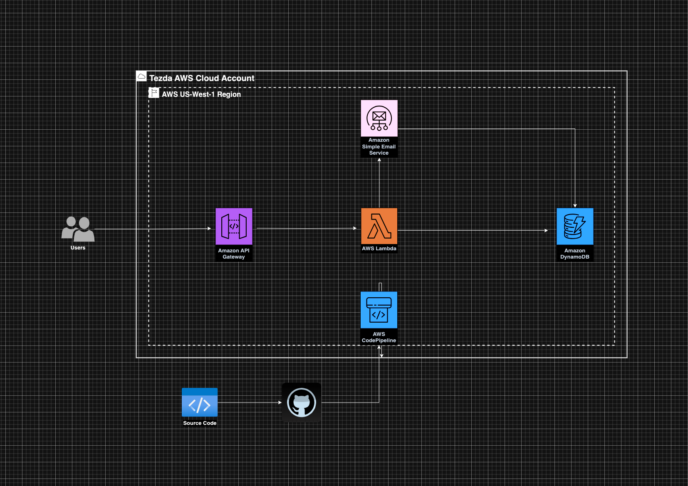

# Tezda Task

### Lambda
This Serverless Lambda API provides functionality for user authentication, registration, and password management. The lambda function is exposed via API Gateway. The database is DynamoDB and I setup a CI/CD pipeline using CodePipeline. When users register they get emailed a link to verify their email address.

### Base URL
https://mul2xiuj3i.execute-api.us-east-1.amazonaws.com/production

### Postman Collection
This is the postman collection for the API. It contains all the endpoints and example requests. It also contains the documentation for the endpoints. 
https://www.postman.com/telecoms-explorer-27073331/workspace/chizobavictory/collection/24035086-9ea1aa49-029c-4e5f-8584-3b20070d62d8?action=share&creator=24035086

### Architecture

### Endpoints
#### Health Check
- Path: /health
- Method: GET
- Description: Check the health of the serverless function.
- Example: GET /health

#### Register
- Path: /register
- Method: POST
- Description: Register a new user.
- Example: POST /register

#### Login
- Path: /login
- Method: POST
- Description: Login a user.
- Example: POST /login

#### Forgot Password
- Path: /forgot-password
- Method: POST
- Description: Send a password reset email to the user.
- Example: POST /forgot-password

#### Reset Password
- Path: /reset-password
- Method: POST
- Description: Reset the user's password.
- Example: POST /reset-password

#### Change Password
- Path: /change-password
- Method: POST
- Description: Change the user's password.
- Example: POST /change-password

#### Refresh Token
- Path: /refresh-token
- Method: POST
- Description: Refresh the user's access token.
- Example: POST /refresh-token
